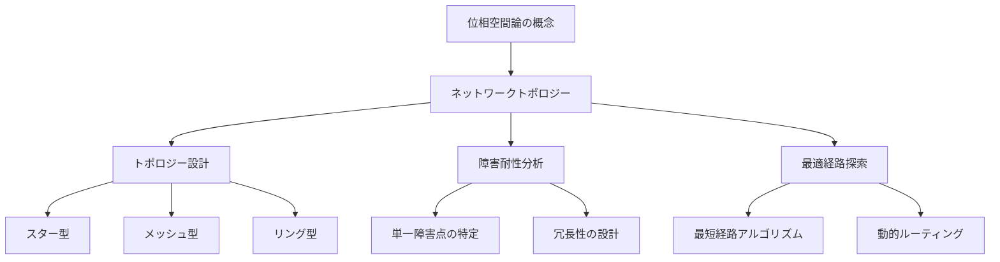
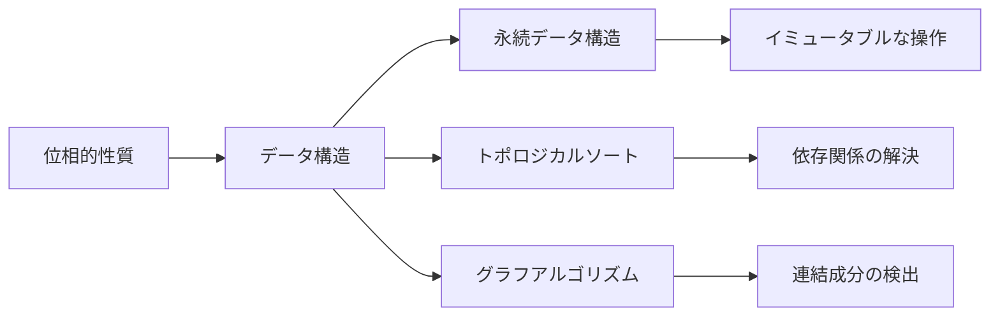
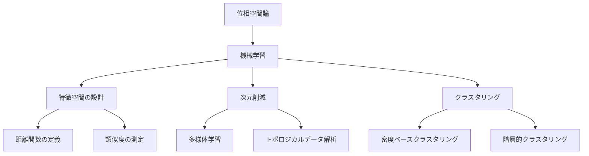
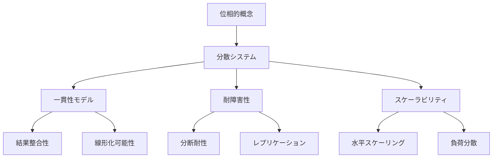

# 位相空間論を技術分野で活用する方法

## What's this file?
> [!NOTE]
> **How**
> 
> どのように位相空間論を技術分野で活用するかについて記載しています。

## Conclusion (忙しいとき向け)
> [!IMPORTANT]
> **How** : どのように位相空間論を技術分野で活用するか
> 
> **Answer** : 位相空間論の概念（連続性、開集合、閉包、コンパクト性など）は、ネットワークトポロジー、データ構造の設計、機械学習の特徴空間、分散システムの耐障害性設計など、様々な技術分野で応用できます。

## 目次

<details>
<summary>目次を開く</summary>

- [1. 位相空間論の基本概念](#1-位相空間論の基本概念)
- [2. ネットワークトポロジーへの応用](#2-ネットワークトポロジーへの応用)
- [3. データ構造とアルゴリズムへの応用](#3-データ構造とアルゴリズムへの応用)
- [4. 機械学習への応用](#4-機械学習への応用)
- [5. 分散システムへの応用](#5-分散システムへの応用)
- [6. 実装例](#6-実装例)

</details>

## 1. 位相空間論の基本概念

位相空間論は、空間の「近さ」や「連続性」を抽象的に扱う数学の分野です。

### 主要な概念
- **開集合**: ある性質を持つ点の集まり
- **閉集合**: 開集合の補集合
- **連続写像**: 開集合の逆像が開集合となる写像
- **コンパクト性**: 任意の開被覆が有限部分被覆を持つ性質
- **連結性**: 分離できない一体的な性質

## 2. ネットワークトポロジーへの応用

### ネットワークの位相的性質



### 応用例
- **連結性**: ネットワークの分断を防ぐ設計
- **コンパクト性**: 効率的なルーティングテーブルの設計
- **開集合**: アクセス可能なノードの集合の定義

## 3. データ構造とアルゴリズムへの応用

### 位相的データ構造



### 具体的な応用
- **DAG（有向非巡回グラフ）**: 位相的順序付けによるタスクスケジューリング
- **永続データ構造**: 時間的な連続性を保つデータ構造
- **空間インデックス**: R-treeなどの空間的近傍探索

## 4. 機械学習への応用

### 特徴空間の位相的性質



### 応用技術
- **t-SNE**: 高次元データの位相的性質を保った可視化
- **UMAP**: 位相的構造を保持する次元削減
- **TDA（トポロジカルデータ解析）**: データの形状的特徴の抽出

## 5. 分散システムへの応用

### 分散システムの位相的性質



### 実用例
- **CAP定理**: ネットワーク分断時の一貫性と可用性のトレードオフ
- **コンセンサスアルゴリズム**: Raftなどの分散合意形成
- **分散ハッシュテーブル**: Chordなどの位相的ルーティング

## 6. 実装例

### Pythonでの簡単な位相的データ解析

```python
import numpy as np
from sklearn.neighbors import NearestNeighbors

class TopologicalSpace:
    def __init__(self, points):
        self.points = np.array(points)
        self.dimension = self.points.shape[1]
    
    def open_ball(self, center, radius):
        """開球を返す"""
        distances = np.linalg.norm(self.points - center, axis=1)
        return self.points[distances < radius]
    
    def is_connected(self, epsilon):
        """ε-連結性を判定"""
        nbrs = NearestNeighbors(radius=epsilon).fit(self.points)
        distances, indices = nbrs.radius_neighbors(self.points)
        
        # 連結成分を見つける
        visited = set()
        components = []
        
        for i in range(len(self.points)):
            if i not in visited:
                component = self._dfs(i, indices, visited)
                components.append(component)
        
        return len(components) == 1
    
    def _dfs(self, start, adjacency, visited):
        """深さ優先探索で連結成分を見つける"""
        stack = [start]
        component = []
        
        while stack:
            node = stack.pop()
            if node not in visited:
                visited.add(node)
                component.append(node)
                stack.extend(adjacency[node])
        
        return component

# 使用例
points = np.random.rand(100, 2)
space = TopologicalSpace(points)

# 開球の取得
center = np.array([0.5, 0.5])
ball = space.open_ball(center, 0.3)

# 連結性の確認
is_connected = space.is_connected(epsilon=0.1)
print(f"空間は連結か: {is_connected}")
```

### ネットワークトポロジー解析

```python
import networkx as nx

class NetworkTopology:
    def __init__(self, graph):
        self.graph = graph
    
    def find_critical_nodes(self):
        """単一障害点（articulation points）を見つける"""
        return list(nx.articulation_points(self.graph))
    
    def measure_connectivity(self):
        """連結性の指標を計算"""
        return nx.node_connectivity(self.graph)
    
    def find_communities(self):
        """位相的に密な部分グラフを見つける"""
        from networkx.algorithms import community
        communities = community.greedy_modularity_communities(self.graph)
        return [list(c) for c in communities]

# 使用例
G = nx.karate_club_graph()
topology = NetworkTopology(G)

critical_nodes = topology.find_critical_nodes()
connectivity = topology.measure_connectivity()
communities = topology.find_communities()

print(f"クリティカルノード: {critical_nodes}")
print(f"連結性: {connectivity}")
print(f"コミュニティ数: {len(communities)}")
```

## 関連

- **圏論**: 位相空間の間の関係を扱う抽象的な枠組み
- **グラフ理論**: 離散的な位相構造の研究
- **微分幾何学**: 滑らかな多様体上の位相的性質
- **代数的トポロジー**: ホモロジーやコホモロジーによる位相不変量
- **計算幾何学**: 位相的性質を考慮したアルゴリズム設計