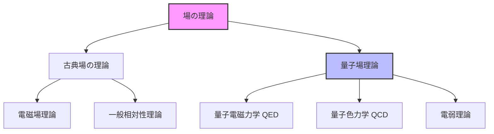
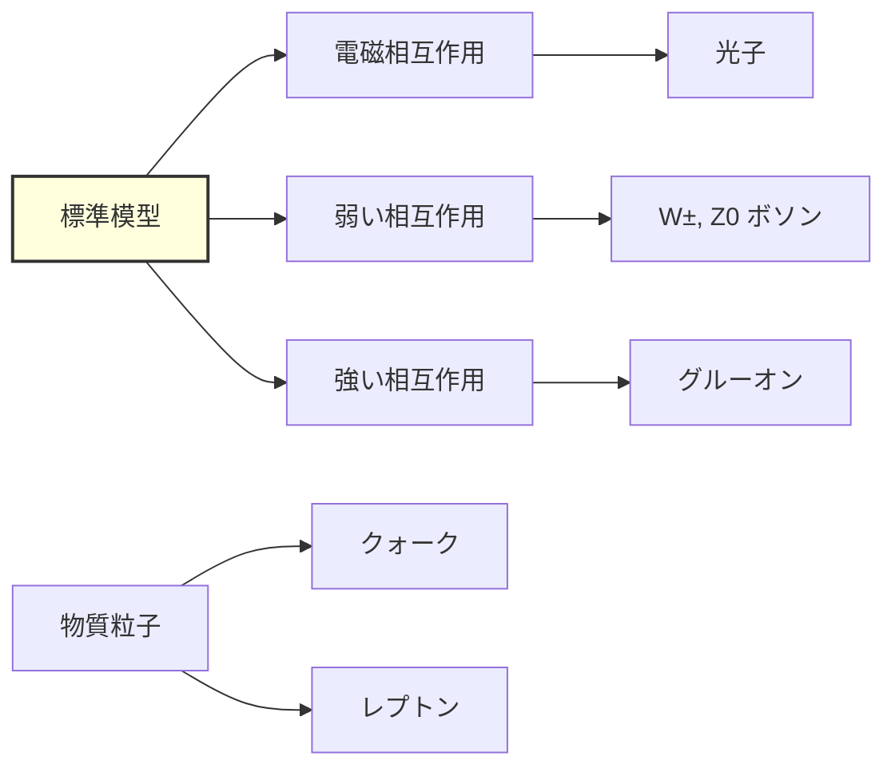
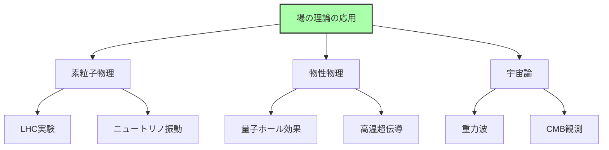

# 物理学における場の理論とは

## What's this file?
> [!NOTE]
> **What**
> 
> 場の理論（Field Theory）とは何かについて記載しています。

## Conclusion (忙しいとき向け)
> [!IMPORTANT]
> **What** : 場の理論とは何か
> 
> **Answer** : 空間の各点に物理量が割り当てられた「場」を扱う物理学の理論体系。粒子ではなく場を基本的な実体として扱い、粒子は場の励起状態として理解される。

## 目次

目次を開く

- [場の理論の基本概念](#場の理論の基本概念)
- [古典場の理論](#古典場の理論)
- [量子場理論](#量子場理論)
- [場の理論の数学的構造](#場の理論の数学的構造)
- [場の理論の応用分野](#場の理論の応用分野)

## 場の理論の基本概念

場の理論は、空間（および時間）の各点において定義される物理量を扱う理論的枠組みです。

### 場とは何か

場（Field）とは、空間の各点に割り当てられた物理量のことです：
- **スカラー場**：各点に数値が割り当てられる（例：温度場、電位）
- **ベクトル場**：各点にベクトルが割り当てられる（例：電場、磁場）
- **テンソル場**：各点にテンソルが割り当てられる（例：重力場）

### 場の理論の特徴

1. **連続性**：場は空間に連続的に分布する
2. **局所性**：相互作用は局所的に起こる
3. **場の方程式**：場の時間発展は偏微分方程式で記述される

## 古典場の理論

### 電磁場理論

マクスウェル方程式で記述される電場と磁場の理論：

$$\nabla \cdot \mathbf{E} = \frac{\rho}{\epsilon_0}$$
$$\nabla \cdot \mathbf{B} = 0$$
$$\nabla \times \mathbf{E} = -\frac{\partial \mathbf{B}}{\partial t}$$
$$\nabla \times \mathbf{B} = \mu_0 \mathbf{j} + \mu_0 \epsilon_0 \frac{\partial \mathbf{E}}{\partial t}$$

### 一般相対性理論

重力を時空の曲がりとして記述する場の理論：

$$R_{\mu\nu} - \frac{1}{2}g_{\mu\nu}R = \frac{8\pi G}{c^4}T_{\mu\nu}$$

## 量子場理論

### 基本原理

量子場理論（Quantum Field Theory, QFT）は、量子力学と特殊相対性理論を統合した理論：

1. **場の量子化**：古典場を演算子として扱う
2. **粒子の生成・消滅**：粒子は場の励起状態
3. **相互作用**：場の相互作用項で記述

### 標準模型

素粒子物理学の標準模型は量子場理論に基づく：

## 場の理論の数学的構造

### ラグランジアン形式

場の理論は通常ラグランジアン密度 $\mathcal{L}$ で記述される：

$$S = \int d^4x \, \mathcal{L}(\phi, \partial_\mu \phi)$$

### 対称性と保存則

ネーターの定理により、対称性は保存則と結びつく：
- **時間並進対称性** → エネルギー保存
- **空間並進対称性** → 運動量保存
- **回転対称性** → 角運動量保存
- **ゲージ対称性** → 電荷保存

## 場の理論の応用分野

### 素粒子物理学

- 基本粒子間の相互作用の記述
- ヒッグス機構による質量生成
- CPT対称性と反物質

### 物性物理学

- 超伝導・超流動の理論
- 相転移と臨界現象
- トポロジカル物質

### 宇宙論

- インフレーション理論
- ダークマターとダークエネルギー
- 初期宇宙の物理

## 関連
- 量子力学
- 特殊相対性理論
- 一般相対性理論
- 素粒子物理学
- 統計力学
- 数理物理学
- ゲージ理論
- 超弦理論