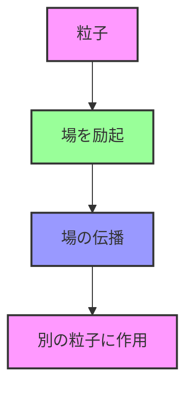
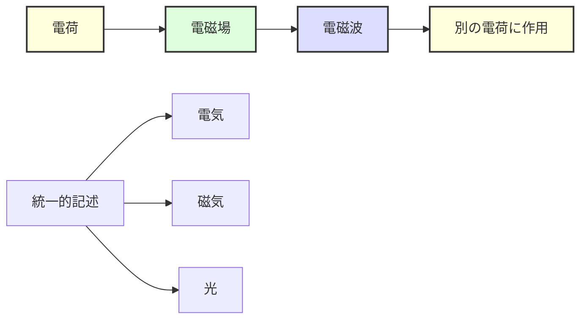
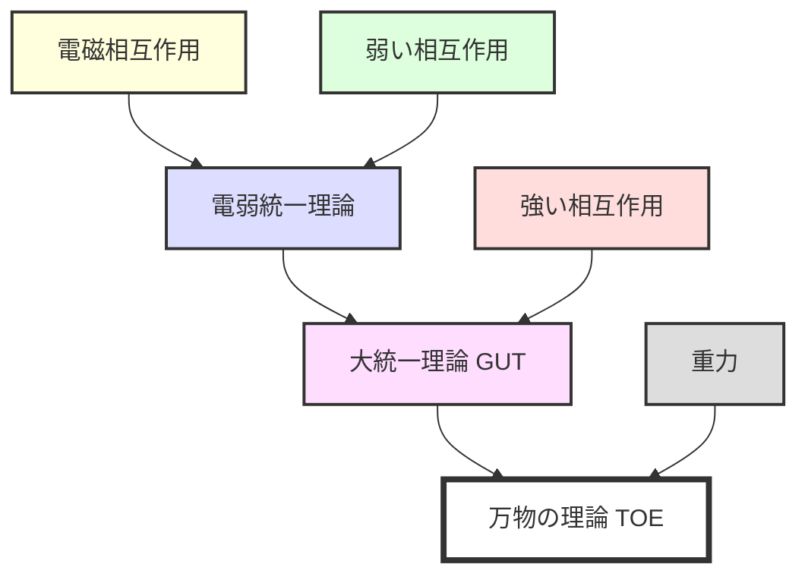

# なぜ物理学で場の理論が必要なのか

## What's this file?
> [!NOTE]
> **Why**
> 
> **なぜ**物理学で場の理論が必要なのか

## Conclusion (忙しいとき向け)
> [!IMPORTANT]
> **Why** : **なぜ**物理学で場の理論が必要なのか
> 
> **Answer** : 自然界の根本的な相互作用を統一的に記述し、粒子物理学から宇宙論まで幅広い現象を説明するため

## 目次

目次を開く

- [古典力学の限界](#古典力学の限界)
- [場の理論の必要性](#場の理論の必要性)
- [場の理論が解決する問題](#場の理論が解決する問題)
- [現代物理学における重要性](#現代物理学における重要性)

## 古典力学の限界

### 遠隔作用の問題

古典力学では、離れた物体間の相互作用（重力など）は瞬時に伝わるとされていた。しかし、これは相対性理論と矛盾する。

### 粒子と波動の二重性

量子力学の発展により、粒子と波動の二重性が明らかになり、これを統一的に扱う枠組みが必要となった。

## 場の理論の必要性

### 1. 相対性理論との整合性

場の理論では、相互作用は場を介して光速以下で伝播する：

### 2. 粒子の生成・消滅の記述

場の理論により、粒子の生成・消滅を自然に記述できる：

- 真空からの粒子対生成
- 粒子の崩壊過程
- 相互作用による粒子変換

### 3. 無限自由度系の取り扱い

場は空間の各点で値を持つため、無限の自由度を持つ系を体系的に扱える。

## 場の理論が解決する問題

### 電磁相互作用の記述

Maxwell方程式は最初の成功した場の理論：

### 素粒子物理学の標準模型

場の理論により、すべての基本相互作用を統一的に記述：

1. **電磁相互作用** - 量子電磁力学（QED）
2. **弱い相互作用** - 電弱統一理論
3. **強い相互作用** - 量子色力学（QCD）
4. **重力相互作用** - 一般相対性理論（古典場の理論）

### 量子場の真空

場の理論では、真空も豊かな構造を持つ：

- 真空の量子揺らぎ
- カシミール効果
- ヒッグス場による質量生成

## 現代物理学における重要性

### 1. 予言能力

場の理論は驚異的な精度で実験結果を予言：

- 電子の異常磁気モーメント（12桁の精度）
- ヒッグス粒子の存在予言と発見

### 2. 統一理論への道

### 3. 技術への応用

場の理論の理解は現代技術の基盤：

- レーザー技術
- 半導体物理
- 量子コンピューティング
- 医療画像診断（MRI等）

## 関連

- [量子力学の基礎](./quantum_mechanics_basics.md)
- [素粒子物理学の標準模型](./standard_model_particle_physics.md)
- [一般相対性理論](./general_relativity.md)
- [量子電磁力学（QED）](./quantum_electrodynamics.md)