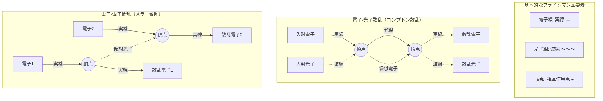
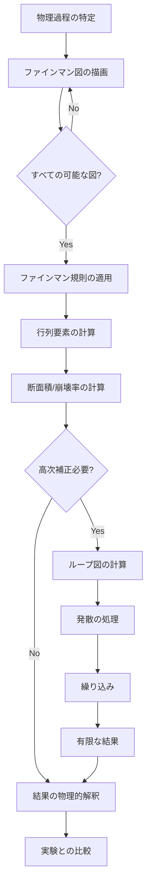
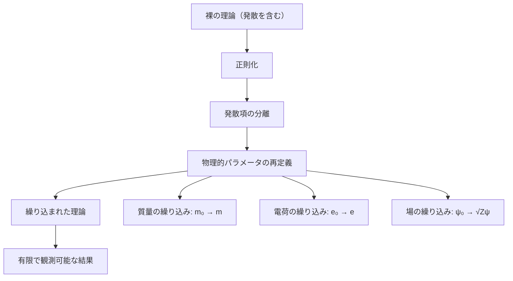

# 量子電磁力学（QED: Quantum Electrodynamics）

## What's this file?

> [!NOTE]
> **What**
> 
> 量子電磁力学（QED）とは何かについて記載しています。

## Conclusion (忙しいとき向け)

> [!IMPORTANT]
> **What** : 量子電磁力学（QED）とは何か
> 
> **Answer** : 電磁相互作用を量子力学的に記述する理論。光子と荷電粒子（電子など）の相互作用を説明し、現代物理学で最も精密に検証された理論の一つ。ファインマン、朝永振一郎、シュウィンガーがノーベル賞を受賞。

## 目次

目次を開く

- [QEDの基本概念](#qedの基本概念)
- [QEDの歴史的発展](#qedの歴史的発展)
- [QEDの基本原理](#qedの基本原理)
- [ファインマン図](#ファインマン図)
- [QEDの計算プロセス](#qedの計算プロセス)
- [主要な物理現象](#主要な物理現象)
- [繰り込み理論](#繰り込み理論)
- [実験的検証](#実験的検証)
- [現代物理学への影響](#現代物理学への影響)

## QEDの基本概念

量子電磁力学（Quantum Electrodynamics, QED）は、電磁相互作用を量子場の理論として記述する物理理論です。光（光子）と物質（主に電子）の相互作用を量子力学的に説明します。

### 主な特徴

- **量子場の理論**: 粒子を場の励起状態として扱う
- **相対論的量子力学**: 特殊相対性理論と量子力学を統合
- **ゲージ理論**: U(1)ゲージ対称性に基づく
- **摂動論**: 結合定数が小さいため摂動計算が有効

## QEDの歴史的発展

### 前史（1920-1940年代）

- **1927年**: ディラックが量子化された電磁場の理論を提案
- **1928年**: ディラック方程式により相対論的電子を記述
- **1930年代**: 無限大の問題（発散）が発見される

### ブレークスルー（1940年代後半）

- **1947年**: ラムシフトの実験的発見
- **1948年**: 朝永振一郎、シュウィンガー、ファインマンが独立に繰り込み理論を開発
- **1949年**: ダイソンが3人の理論の等価性を証明

### ノーベル賞（1965年）

朝永振一郎、ジュリアン・シュウィンガー、リチャード・ファインマンが「量子電磁力学の基礎研究」でノーベル物理学賞を受賞。

## QEDの基本原理

### ラグランジアン

QEDのラグランジアン密度：

$$\mathcal{L} = \bar{\psi}(i\gamma^\mu\partial_\mu - m)\psi - e\bar{\psi}\gamma^\mu\psi A_\mu - \frac{1}{4}F_{\mu\nu}F^{\mu\nu}$$

ここで：
- $\psi$: 電子場（ディラック場）
- $A_\mu$: 電磁場（光子場）
- $F_{\mu\nu}$: 電磁場テンソル
- $e$: 電気素量
- $m$: 電子質量
- $\gamma^\mu$: ガンマ行列

### 基本的な相互作用

- **電子-光子相互作用**: 電子が光子を吸収・放出
- **光子の伝播**: 仮想光子による電磁力の媒介
- **電子-陽電子対生成・消滅**: 真空からの粒子対生成

## ファインマン図

ファインマン図は、QEDの相互作用を視覚的に表現する強力なツールです。

## QEDの計算プロセス

## 主要な物理現象

### 1. ラムシフト

水素原子の2S₁/₂と2P₁/₂準位のエネルギー差。QED効果により説明される。

### 2. 異常磁気モーメント

電子の磁気モーメント：
$$\mu = (1 + a)\mu_B$$
ここで、$a \approx 0.00115965218$ (QED補正)

### 3. カシミール効果

真空中の2枚の導体板間に働く引力。真空の量子揺らぎによる。

### 4. 光子-光子散乱

真空中での光子同士の散乱。電子-陽電子対の仮想生成を介して起こる。

## 繰り込み理論

### 発散の問題

ループ図の計算で現れる無限大を処理する必要がある：

1. **紫外発散**: 高エネルギー（短距離）での発散
2. **赤外発散**: 低エネルギー（長距離）での発散

### 繰り込みの手順

注：繰り込みのパラメータ変換
- 質量: $m_0 \rightarrow m$
- 電荷: $e_0 \rightarrow e$  
- 場: $\psi_0 \rightarrow \sqrt{Z}\psi$

## 実験的検証

### 精密測定の例

1. **電子の異常磁気モーメント**
   - 理論値: 1.00115965218091(26)
   - 実験値: 1.00115965218073(28)
   - 一致精度: $10^{-12}$

2. **ラムシフト**
   - 理論と実験の一致: $10^{-6}$の精度

3. **超微細構造**
   - ポジトロニウムの分裂
   - ミューオニウムの分光

### 現代の実験

- **g-2実験**: ミューオンの異常磁気モーメント測定
- **原子干渉計**: 精密な基礎定数測定
- **反水素の分光**: CPT対称性の検証

## 現代物理学への影響

### 1. 標準模型への道

QEDの成功は、弱い相互作用と強い相互作用の量子場理論の発展を促した：

- **電弱統一理論**: グラショウ・ワインバーグ・サラム理論
- **量子色力学（QCD）**: 強い相互作用の理論
- **標準模型**: すべての基本相互作用（重力を除く）の統一的記述

### 2. 技術への応用

- **レーザー技術**: 誘導放出の理解
- **半導体技術**: 電子-正孔相互作用
- **量子コンピュータ**: 量子状態の制御

### 3. 概念的影響

- **仮想粒子**: 真空は「空」ではない
- **対称性と保存則**: ネーターの定理の具体例
- **有効場の理論**: 階層的な物理の記述

## 関連

- [場の理論（物理学）](../daily/2025.08.20.19.36_what_field_theory_in_physics.md)
- [ファインマン図とは何か]
- [標準模型入門]
- [ゲージ理論の基礎]
- [量子力学から量子場理論へ]