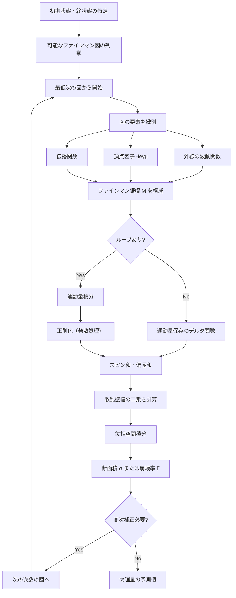
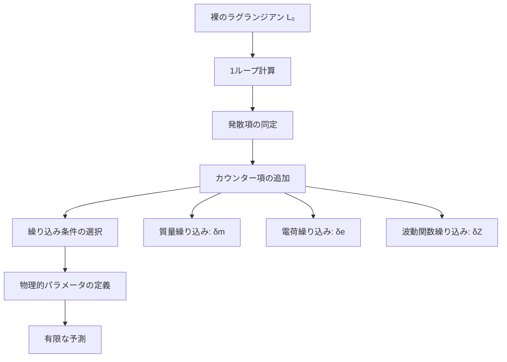

# 量子電磁力学のファインマン則（Feynman Rules）

## What's this file?

> [!NOTE]
> **What**
> 
> 量子電磁力学におけるファインマン則とは何かについて記載しています。

## Conclusion (忙しいとき向け)

> [!IMPORTANT]
> **What** : 量子電磁力学のファインマン則とは何か
> 
> **Answer** : ファインマン図から散乱振幅を計算するための数学的規則。各頂点、伝播関数、外線に対応する数式を与え、QEDの物理過程を系統的に計算可能にする処方箋。視覚的な図から定量的な予測を導く強力なツール。

## 目次

<details>
<summary>目次を開く</summary>

- [ファインマン則の基本概念](#ファインマン則の基本概念)
- [基本要素と対応する数式](#基本要素と対応する数式)
- [ファインマン則の適用手順](#ファインマン則の適用手順)
- [計算フローチャート](#計算フローチャート)
- [具体的な計算例](#具体的な計算例)
- [運動量保存と積分](#運動量保存と積分)
- [対称因子と符号規則](#対称因子と符号規則)
- [高次補正と繰り込み](#高次補正と繰り込み)

</details>

## ファインマン則の基本概念

ファインマン則（Feynman Rules）は、ファインマン図の各要素に対応する数学的表現を与える規則です。これにより、複雑な量子過程の計算を系統的に実行できます。

### 主な特徴

- **図形的表現から数式へ**: 視覚的な図を定量的計算に変換
- **摂動展開の各項に対応**: 結合定数のべき乗で展開
- **自動的な計算手順**: 機械的に適用可能
- **ローレンツ不変性**: 相対論的に正しい結果を保証

## 基本要素と対応する数式

### 1. 外線（External Lines）

| 粒子 | 図形表現 | 数学的表現 |
|------|----------|------------|
| 入射電子 | →─── | u(p, s) |
| 出射電子 | ───→ | ū(p', s') |
| 入射陽電子 | ←─── | v̄(p, s) |
| 出射陽電子 | ───← | v(p', s') |
| 入射光子 | 〜〜〜→ | εμ(k, λ) |
| 出射光子 | →〜〜〜 | ε*μ(k', λ') |

### 2. 内線（伝播関数）

**電子伝播関数（フェルミオン）**:
```
   p
────→──── = i(γμpμ + m)/(p² - m² + iε)
```

**光子伝播関数（ボソン）**:
```
   k
〜〜〜〜〜 = -igμν/(k² + iε)
```

### 3. 頂点（相互作用）

**QED頂点**:
```
    ╱
   ●〜〜〜 = -ieγμ
  ╱
```

## ファインマン則の適用手順

### ステップ1: すべての可能な図を描く

与えられた初状態と終状態に対して、すべての位相的に異なるファインマン図を列挙します。

### ステップ2: 各図に対してファインマン振幅を書く

1. **外線因子**: 各外線に対応する波動関数または偏極ベクトル
2. **頂点因子**: 各頂点に $-ie\gamma^\mu$
3. **伝播関数**: 各内線に対応する伝播関数
4. **運動量積分**: ループがある場合は積分 $\int \frac{d^4p}{(2\pi)^4}$

### ステップ3: 運動量保存を課す

各頂点で運動量保存：$\sum p_{\text{in}} = \sum p_{\text{out}}$

### ステップ4: 行列要素を計算

スピノル積やガンマ行列の跡を計算

## 計算フローチャート



## 具体的な計算例

### 例1: 電子-ミューオン散乱（最低次）

```
e⁻(p₁) ────→──── e⁻(p₃)
            ╲  ╱
             〜
            ╱  ╲
μ⁻(p₂) ────→──── μ⁻(p₄)
```

**ファインマン振幅**:

$$\mathcal{M} = \bar{u}(p_3)(-ie\gamma^\mu)u(p_1) \times \frac{-ig_{\mu\nu}}{q^2} \times \bar{u}(p_4)(-ie\gamma^\nu)u(p_2)$$

ここで、$q = p_1 - p_3 = p_4 - p_2$

### 例2: コンプトン散乱

```
γ(k) 〜〜〜→● →─────→● →〜〜〜 γ(k')
           ╱         ╲
    e⁻(p)─→           →─e⁻(p')
```

**ファインマン振幅（s-チャネル）**:

$$\mathcal{M}_s = \varepsilon^*_\mu(k')\bar{u}(p')(-ie\gamma^\mu) \times \frac{i(\gamma \cdot (p+k)+m)}{(p+k)^2-m^2} \times (-ie\gamma^\nu)u(p)\varepsilon_\nu(k)$$

## 運動量保存と積分

### ツリーレベル（ループなし）

運動量保存: $(2\pi)^4\delta^4(\sum p_{\text{initial}} - \sum p_{\text{final}})$

### ループレベル

各ループに対して：

$$\int \frac{d^4k}{(2\pi)^4} \times [\text{ループ内の伝播関数と頂点の積}]$$

### 積分の評価

1. **ファインマンパラメータ**: 分母を結合
2. **ウィック回転**: 実軸→虚軸で収束性改善
3. **次元正則化**: $d = 4 - \varepsilon$次元で計算

## 対称因子と符号規則

### 対称因子

- **同一粒子の交換**: 1/n! （n個の同一粒子）
- **同一の図の数**: トポロジカルに等価な図の数で割る

### 符号規則

- **フェルミオンループ**: (-1)因子
- **フェルミオン線の交差**: 各交差で(-1)

### 色因子（QCDの場合）

QEDでは色はないが、QCDでは追加の色因子が必要

## 高次補正と繰り込み

### 1ループ補正の例

**電子自己エネルギー**:
```
──→──●〜〜〜●──→──
      ╲   ╱
       →─→
```

**光子自己エネルギー（真空偏極）**:
```
〜〜〜●→─────→●〜〜〜
      ╲     ╱
       ←───←
```

**頂点補正**:
```
    〜
    │
    ●←──●
   ╱│   │╲
  → └───┘ →
```

### 繰り込み手順



### 走る結合定数

$$\alpha(Q^2) = \frac{\alpha(\mu^2)}{1 - \frac{\alpha(\mu^2)}{3\pi}\ln\left(\frac{Q^2}{\mu^2}\right)}$$

高エネルギーでの結合定数の変化を記述

## 関連

- [量子電磁力学（QED）](../daily/2025.08.20.21.07_what_quantum_electrodynamics_qed.md)
- [ファインマン図とは何か]
- [摂動論と散乱理論]
- [ループ積分の計算技法]
- [次元正則化と繰り込み]