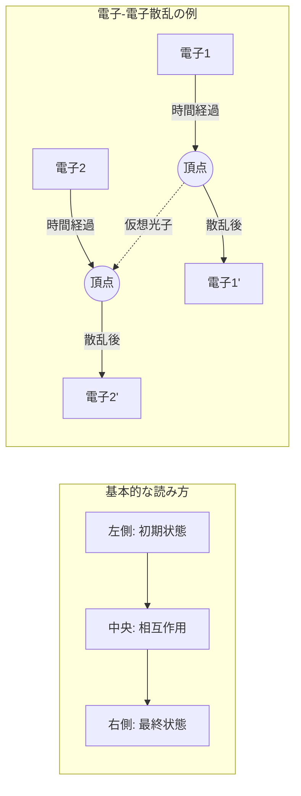
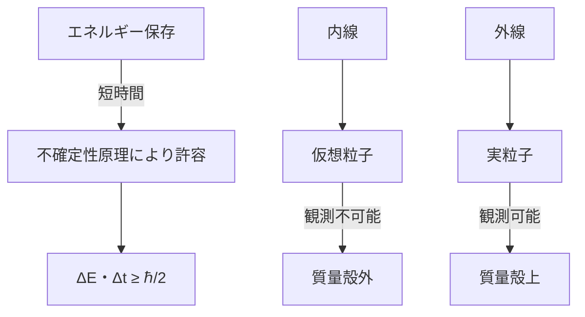
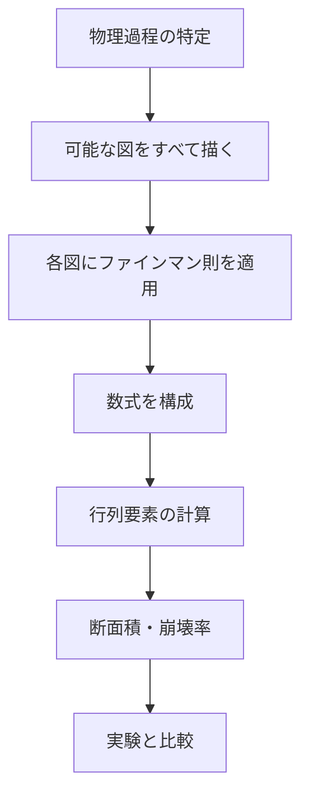
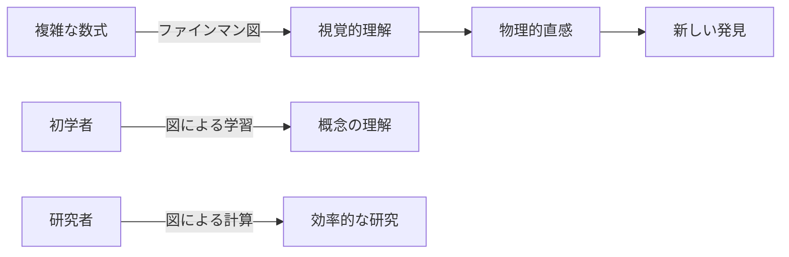

# ファインマン図（Feynman Diagram）

## What's this file?

> [!NOTE]
> **What**
> 
> ファインマン図とは何かについて記載しています。

## Conclusion (忙しいとき向け)

> [!IMPORTANT]
> **What** : ファインマン図とは何か
> 
> **Answer** : 素粒子の相互作用を視覚的に表現する図式。リチャード・ファインマンが開発した、量子場理論の計算を簡潔に表現するツール。線と頂点で粒子の生成・消滅・相互作用を表し、複雑な数式計算を直感的に理解可能にする。

## 目次

<details>
<summary>目次を開く</summary>

- [ファインマン図の基本概念](#ファインマン図の基本概念)
- [歴史と背景](#歴史と背景)
- [基本要素と表記法](#基本要素と表記法)
- [ファインマン図の読み方](#ファインマン図の読み方)
- [主要な図のパターン](#主要な図のパターン)
- [物理的意味と解釈](#物理的意味と解釈)
- [計算への応用](#計算への応用)
- [現代物理学での役割](#現代物理学での役割)

</details>

## ファインマン図の基本概念

ファインマン図は、素粒子物理学において粒子間の相互作用を図形的に表現する方法です。時空における粒子の運動と相互作用を、線と頂点を使って視覚化します。

### 主な特徴

- **視覚的表現**: 複雑な量子過程を図で表現
- **計算ツール**: 各図が数式に対応
- **摂動展開**: 相互作用の強さによる展開の各項を表現
- **直感的理解**: 物理過程を視覚的に把握

### 座標系

```
    時間 ↑
        │
        │
    ────┼──── 空間 →
        │
        │
```

通常、縦軸が時間、横軸が空間を表します（慣例により異なる場合あり）。

## 歴史と背景

### 開発の経緯

1940年代後半、リチャード・ファインマンが量子電磁力学（QED）の計算を簡潔に行うために開発しました。

### 重要な貢献

- **1948年**: ファインマンが最初の図を導入
- **1949年**: フリーマン・ダイソンが数学的基礎を確立
- **1965年**: ファインマンがノーベル物理学賞受賞

### 革新性

従来の複雑な数式計算を、直感的な図に置き換えることで：
- 計算の見通しが改善
- 物理的解釈が明確化
- 教育・研究の効率が向上

## 基本要素と表記法

### 1. 線の種類

| 粒子の種類 | 表記 | 説明 |
|-----------|------|------|
| フェルミオン（電子など） | ────→──── | 実線with矢印 |
| 反フェルミオン（陽電子など） | ────←──── | 実線with逆矢印 |
| ボソン（光子） | 〜〜〜〜〜 | 波線 |
| Wボソン、Zボソン | ～～～～～ | 波線（太線） |
| グルーオン | ≈≈≈≈≈ | らせん線 |
| ヒッグス粒子 | ━ ━ ━ ━ | 破線 |

### 2. 頂点（相互作用点）

```
    ╱
   ● ← 頂点（粒子が相互作用する点）
  ╱ ╲
```

### 3. 時間の流れ

```
初期状態        中間状態        最終状態
   │              │              │
   ├──────────────┼──────────────┤
   │              │              │
   t=0            t             t=T
```

## ファインマン図の読み方



### 読み方のルール

1. **時間の流れ**: 通常左から右（または下から上）
2. **保存則**: 各頂点でエネルギー・運動量・電荷が保存
3. **仮想粒子**: 内線は直接観測されない仮想粒子
4. **外線**: 観測可能な実粒子

## 主要な図のパターン

### 1. s-チャネル（時間的チャネル）

```
    A ───→─── C
         ╲╱
          ×
         ╱╲
    B ───→─── D
```

### 2. t-チャネル（空間的チャネル）

```
    A ───→───→─── C
         │
         │ 交換
         │
    B ───→───→─── D
```

### 3. ループ図（高次補正）

```
    ──→──●～～～●──→──
         ╲     ╱
          →───→
```

### 4. バブル図（真空偏極）

```
    ～～～●→─────→●～～～
          ╲     ╱
           ←───←
```

## 物理的意味と解釈

### 仮想粒子の概念



### 相互作用の強さ

- **頂点の数**: 結合定数のべき乗に対応
- **ループの数**: 高次の量子補正
- **最低次**: ツリーレベル（古典的近似）

## 計算への応用

### ファインマン図から物理量へ



### 摂動展開との対応

```
散乱振幅 = Σ(各ファインマン図の寄与)
        = 最低次 + 1次補正 + 2次補正 + ...
```

### 計算の簡略化

1. **対称性の利用**: 同じ寄与をする図をまとめる
2. **選択規則**: 禁止される過程を除外
3. **近似**: 主要な寄与のみを計算

## 現代物理学での役割

### 1. 素粒子物理学

- **標準模型**: すべての相互作用をファインマン図で記述
- **新物理の探索**: 未知の粒子や相互作用の予測
- **精密計算**: 高次補正による理論予測の改善

### 2. 凝縮系物理学

- **多体問題**: 電子間相互作用の記述
- **準粒子**: フォノン、マグノンなどの記述
- **グリーン関数**: 物性計算への応用

### 3. 宇宙論

- **初期宇宙**: 粒子の生成・消滅過程
- **暗黒物質**: 相互作用の理論的予測
- **インフレーション**: 量子揺らぎの計算

### 4. 教育・研究



### 現代的拡張

- **超対称性理論**: 新しい粒子と相互作用
- **弦理論**: 高次元での相互作用
- **量子重力**: 重力の量子効果

## 関連

- [量子電磁力学（QED）](../daily/2025.08.20.21.07_what_quantum_electrodynamics_qed.md)
- [ファインマン則](../daily/2025.08.20.21.18_what_feynman_rules_in_quantum_electrodynamics.md)
- [素粒子物理学の標準模型]
- [場の量子論](../daily/2025.08.20.19.36_what_field_theory_in_physics.md)
- [摂動論とその応用]