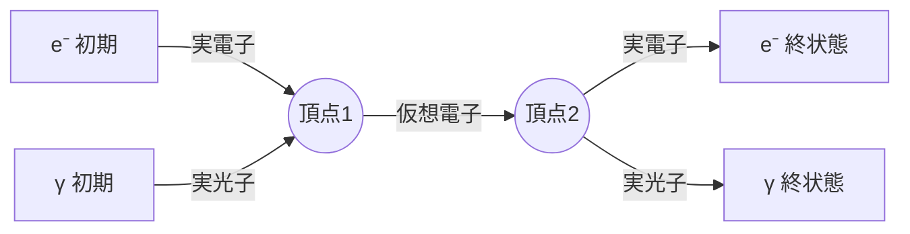
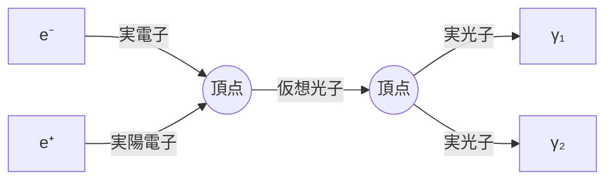
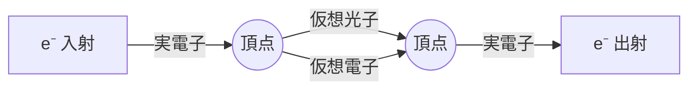
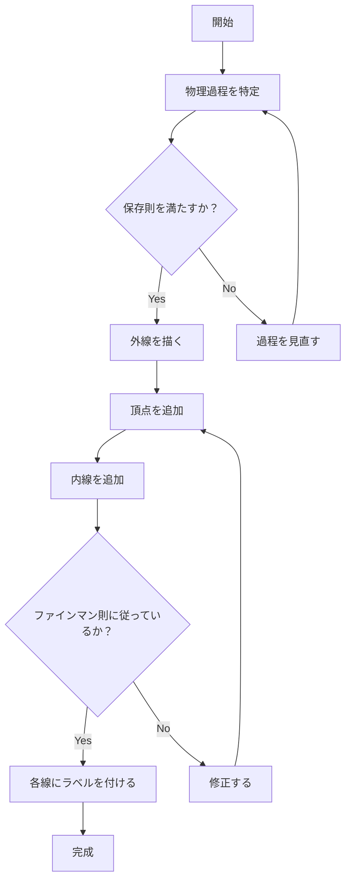

# 特定の状況に対応するファインマン図を描く方法

## What's this file?
> [!NOTE]
> **How**
> 
> どのように特定の状況に対応するファインマン図を描くかについて記載しています。

## Conclusion (忙しいとき向け)
> [!IMPORTANT]
> **How** : どのように特定の状況に対応するファインマン図を描くか
> 
> **Answer** : 1) 相互作用の種類を特定する 2) 初期状態と終状態を明確にする 3) 適切な頂点と内線を配置する 4) ファインマン則に従って図を完成させる

## 目次

目次を開く

- [1. ファインマン図の描画手順](#1-ファインマン図の描画手順)
- [2. 状況別の描画方法](#2-状況別の描画方法)
  - [2.1 電子-光子散乱](#21-電子-光子散乱)
  - [2.2 電子-陽電子対消滅](#22-電子-陽電子対消滅)
  - [2.3 高次補正図](#23-高次補正図)
- [3. 描画フローチャート](#3-描画フローチャート)
- [4. よくある間違いと注意点](#4-よくある間違いと注意点)

## 1. ファインマン図の描画手順

ファインマン図を描く基本的な手順は以下の通りです：

1. **物理過程の特定**
   - どのような粒子が関与しているか
   - 初期状態と終状態は何か
   - どの相互作用が働いているか

2. **保存則の確認**
   - エネルギー・運動量保存
   - 電荷保存
   - その他の量子数保存

3. **図の構成**
   - 外線（初期・終状態の粒子）を配置
   - 内線（仮想粒子）を追加
   - 頂点を適切に配置

## 2. 状況別の描画方法

### 2.1 電子-光子散乱

コンプトン散乱の例：

### 2.2 電子-陽電子対消滅

### 2.3 高次補正図

自己エネルギー補正の例：

## 3. 描画フローチャート

## 4. よくある間違いと注意点

1. **時間順序**
   - ファインマン図は時空図ではない
   - 左から右への配置は慣習的なもの

2. **頂点の規則**
   - QEDでは3点頂点のみ（電子-電子-光子）
   - 4点頂点は存在しない

3. **内線の扱い**
   - 仮想粒子は質量殻上にない
   - 運動量積分が必要

4. **矢印の向き**
   - フェルミオンの矢印は粒子の流れ
   - 反粒子は時間を逆行

## 関連
- [ファインマン図とは何か](2025.08.20.21.25_what_feynman_diagram.md)
- [量子電磁力学（QED）](2025.08.20.21.07_what_quantum_electrodynamics_qed.md)
- [ファインマン則](2025.08.20.21.18_what_feynman_rules_in_quantum_electrodynamics.md)