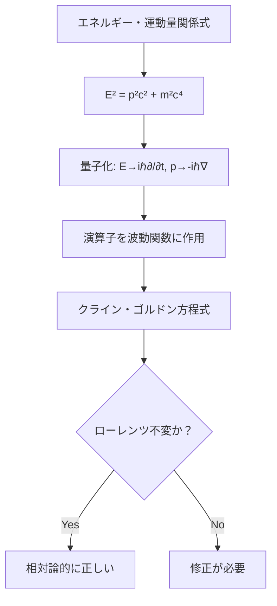
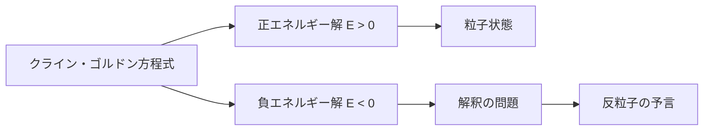
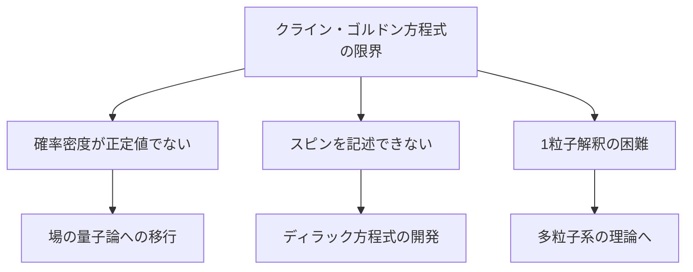

# クライン・ゴルドン方程式

## What's this file?
> [!NOTE]
> **What**
> 
> クライン・ゴルドン方程式とは何かについて記載しています。

## Conclusion (忙しいとき向け)
> [!IMPORTANT]
> **What** : クライン・ゴルドン方程式とは何か
> 
> **Answer** : 相対論的量子力学における基本方程式で、スピン0の粒子を記述する波動方程式。特殊相対性理論と量子力学を統合した最初の方程式。

## 目次

目次を開く

- [1. クライン・ゴルドン方程式の基本](#1-クラインゴルドン方程式の基本)
- [2. 方程式の導出](#2-方程式の導出)
- [3. 物理的意味](#3-物理的意味)
- [4. 解の性質](#4-解の性質)
- [5. 応用と限界](#5-応用と限界)

## 1. クライン・ゴルドン方程式の基本

クライン・ゴルドン方程式は以下の形で表されます：

$$(\Box + m^2)\phi = 0$$

ここで：
- $\Box = \frac{\partial^2}{\partial t^2} - \nabla^2$ （ダランベール演算子）
- $m$：粒子の質量（自然単位系で$\hbar=c=1$）
- $\phi$：スカラー場

より詳細に書くと：

$$\left(\frac{1}{c^2}\frac{\partial^2}{\partial t^2} - \nabla^2 + \frac{m^2c^2}{\hbar^2}\right)\phi = 0$$

## 2. 方程式の導出

## 3. 物理的意味

### 3.1 相対論的効果の取り込み

- **ローレンツ不変性**：方程式が座標変換で形を変えない
- **光速度の上限**：情報伝播速度が光速を超えない
- **質量エネルギー等価性**：$E=mc^2$の関係を含む

### 3.2 量子力学的性質

- **波動性**：粒子の波動的振る舞いを記述
- **確率解釈**：（ただし問題あり、後述）
- **不確定性原理**：位置と運動量の同時確定不可能性

## 4. 解の性質

### 4.1 平面波解

自由粒子の解：

$$\phi = \exp\left(-i\frac{Et - \mathbf{p} \cdot \mathbf{x}}{\hbar}\right)$$

ただし、$E = \pm\sqrt{p^2c^2 + m^2c^4}$

### 4.2 正負のエネルギー解

## 5. 応用と限界

### 5.1 応用分野

1. **場の量子論**
   - スカラー場の記述
   - π中間子などスピン0粒子

2. **素粒子物理学**
   - ヒッグス場の記述
   - 有効理論の構築

### 5.2 限界と問題点

### 5.3 非相対論的極限

$v \ll c$ の極限で、シュレーディンガー方程式に帰着：

$$i\hbar\frac{\partial\psi}{\partial t} = \left(-\frac{\hbar^2}{2m}\nabla^2 + V\right)\psi$$

## 関連
- [量子電磁力学（QED）](2025.08.20.21.07_what_quantum_electrodynamics_qed.md)
- [場の理論が物理学において必要な理由](2025.08.20.19.40_why_field_theory_physics_necessary.md)
- [物理学における場の理論](2025.08.20.19.36_what_field_theory_in_physics.md)