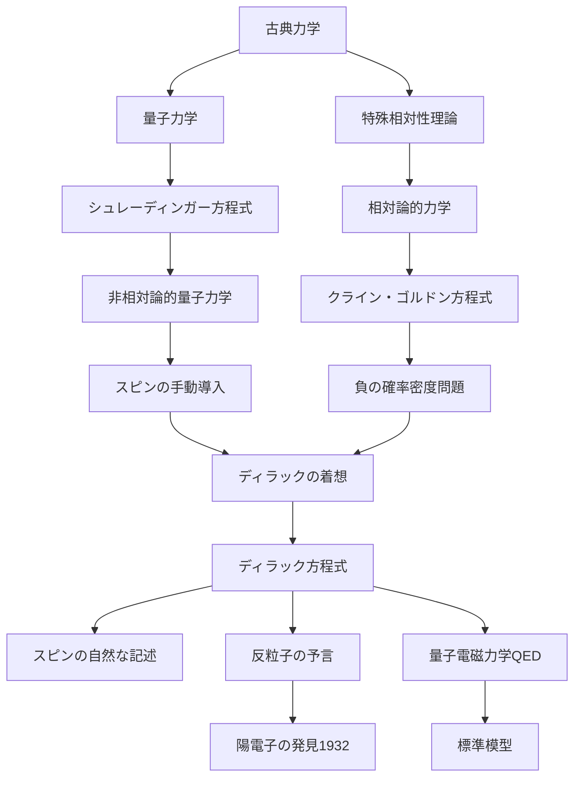

# ディラック方程式

## What's this file?
> [!NOTE]
> **What**
> 
> ディラック方程式とは何かについて記載しています。

## Conclusion (忙しいとき向け)
> [!IMPORTANT]
> **What** : ディラック方程式とは何か
> 
> **Answer** : 相対論的量子力学を記述する基本方程式。スピン1/2の粒子（電子など）の振る舞いを正確に表現し、反粒子の存在を予言した歴史的に重要な方程式。

## 目次

目次を開く

- [概要](#概要)
- [数学的表現](#数学的表現)
- [物理的意味](#物理的意味)
- [歴史的背景](#歴史的背景)
- [主な応用](#主な応用)
- [フローチャート](#フローチャート)

## 概要

ディラック方程式は、1928年にポール・ディラックによって提案された相対論的量子力学の基本方程式です。この方程式は以下の特徴を持ちます：

- **相対論的**：特殊相対性理論と量子力学を統合
- **スピン記述**：電子のスピン（自転）を自然に含む
- **反粒子予言**：陽電子（反電子）の存在を理論的に予言

## 数学的表現

ディラック方程式は以下のような形で表されます：

$$(i\gamma^\mu\partial_\mu - m)\psi = 0$$

ここで：
- $\psi$：4成分のディラック・スピノル（波動関数）
- $\gamma^\mu$：ガンマ行列（4×4の行列）
- $\partial_\mu$：4次元微分演算子
- $m$：粒子の質量
- $i$：虚数単位

より馴染みのある形では：

$$i\hbar\frac{\partial\psi}{\partial t} = (c\boldsymbol{\alpha} \cdot \mathbf{p} + \beta mc^2)\psi$$

## 物理的意味

### 1. エネルギーと運動量の関係

ディラック方程式は、相対論的エネルギー・運動量関係を満たします：

$$E^2 = (pc)^2 + (mc^2)^2$$

### 2. スピンの自然な導入

- 非相対論的なシュレーディンガー方程式では手動で導入する必要があったスピンが、自然に現れる
- スピン1/2の粒子を正確に記述

### 3. 反粒子の存在

- 負のエネルギー解の解釈として反粒子（陽電子）の概念を導入
- 1932年にアンダーソンによって陽電子が実験的に発見され、理論の正当性が証明

## 歴史的背景

### 動機
1. **クライン・ゴルドン方程式の問題点**
   - 確率密度が負になる可能性
   - スピンを記述できない

2. **ディラックのアプローチ**
   - 時間に関する1階微分方程式を求める
   - 行列を用いた独創的な定式化

### 影響
- 量子電磁力学（QED）の基礎
- 素粒子物理学の標準模型の礎
- 反物質の概念の確立

## 主な応用

### 1. 原子物理学
- 水素原子のスペクトルの精密な計算
- スピン軌道相互作用の説明

### 2. 素粒子物理学
- クォークやレプトンの記述
- ゲージ理論の基礎

### 3. 物性物理学
- グラフェンの電子状態
- トポロジカル絶縁体の理論

## フローチャート

## 関連
- [クライン・ゴルドン方程式](./2025.08.20.21.46_what_klein_gordon_equation.md)
- [量子電磁力学（QED）](./2025.08.20.21.07_what_quantum_electrodynamics_qed.md)
- [場の理論](./2025.08.20.19.36_what_field_theory_in_physics.md)