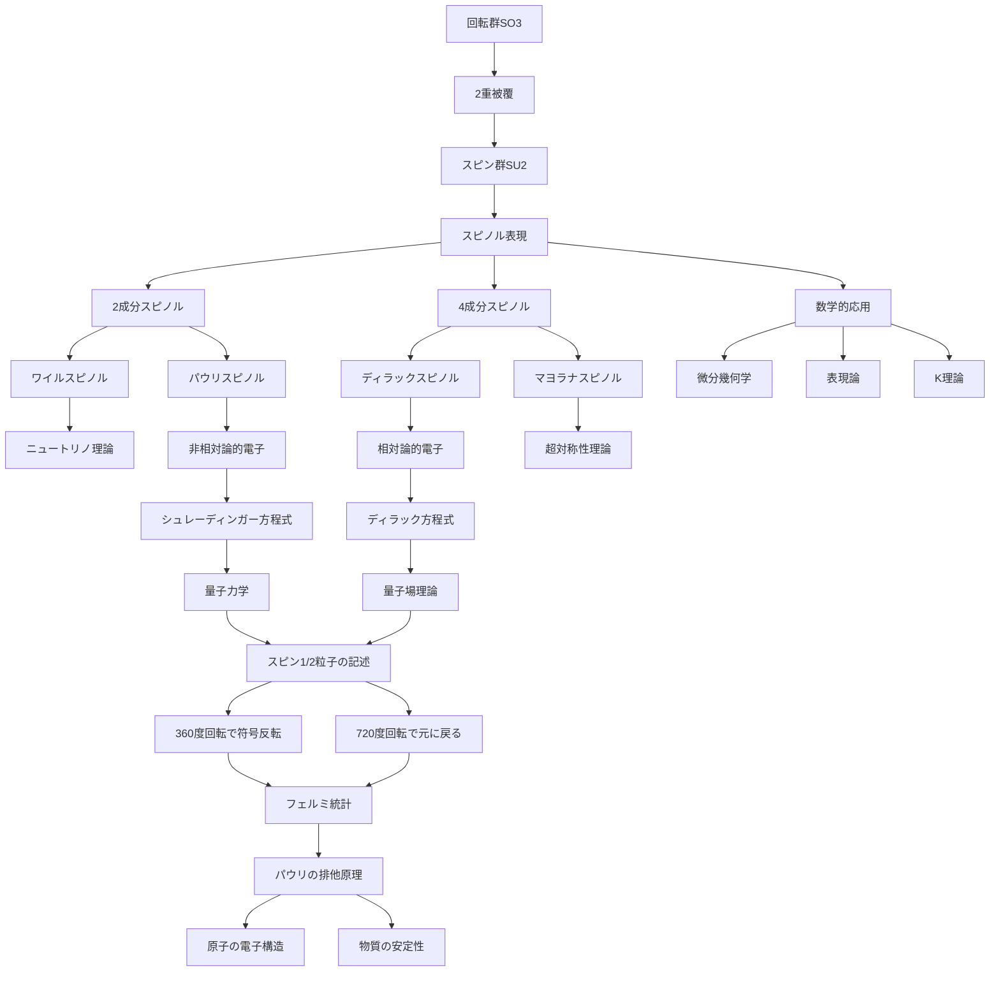

# スピノル（物理学）

## What's this file?
> [!NOTE]
> **What**
> 
> スピノルとは何かについて記載しています。

## Conclusion (忙しいとき向け)
> [!IMPORTANT]
> **What** : スピノルとは何か
> 
> **Answer** : 回転変換に対して特殊な変換性を持つ数学的対象。通常のベクトルとは異なり、360度回転しても元に戻らず、720度（2回転）で初めて元に戻る性質を持つ。電子などのスピン1/2粒子の記述に不可欠。

## 目次

目次を開く

- [概要](#概要)
- [数学的定義](#数学的定義)
- [物理的意味](#物理的意味)
- [スピノルの種類](#スピノルの種類)
- [具体例](#具体例)
- [応用分野](#応用分野)
- [フローチャート](#フローチャート)

## 概要

スピノルは、空間の回転に対して特殊な変換性質を示す数学的対象です。主な特徴：

- **2重被覆性**：360度回転で符号が反転、720度回転で元に戻る
- **スピン1/2粒子の記述**：電子、陽子、中性子などフェルミオンの波動関数
- **幾何学的構造**：リー群SO(3)の2重被覆群SU(2)の表現

## 数学的定義

### パウリ行列

スピノルの基礎となるパウリ行列：

$$
\sigma_1 = \begin{pmatrix} 0 & 1 \\ 1 & 0 \end{pmatrix}, \quad
\sigma_2 = \begin{pmatrix} 0 & -i \\ i & 0 \end{pmatrix}, \quad
\sigma_3 = \begin{pmatrix} 1 & 0 \\ 0 & -1 \end{pmatrix}
$$

### 2成分スピノル

最も基本的なスピノル（ワイルスピノル）：

$$
\chi = \begin{pmatrix} \chi_1 \\ \chi_2 \end{pmatrix}
$$

ここで、$\chi_1$と$\chi_2$は複素数成分。

### 回転変換

角度$\theta$、軸$\hat{n}$まわりの回転：

$$
\chi' = \exp\left(-i\frac{\theta}{2} \hat{n} \cdot \vec{\sigma}\right) \chi
$$

## 物理的意味

### 1. スピンの表現

スピノルは量子力学的スピンを自然に記述：

- **スピン演算子**：$\vec{S} = \frac{\hbar}{2} \vec{\sigma}$
- **固有状態**：スピン上向き $|↑\rangle$、下向き $|↓\rangle$

### 2. 波動関数としてのスピノル

電子の波動関数は位置とスピンの関数：

$$
\psi(\vec{r},t) = \begin{pmatrix} \psi_\uparrow(\vec{r},t) \\ \psi_\downarrow(\vec{r},t) \end{pmatrix}
$$

### 3. 幾何学的位相

- **ベリー位相**：パラメータ空間での循環で獲得する位相
- **アハラノフ・ボーム効果**：電磁場がない領域でも位相が変化

## スピノルの種類

### 1. ワイルスピノル（2成分）
- 質量ゼロの粒子を記述
- カイラリティ（左巻き/右巻き）を持つ

### 2. ディラックスピノル（4成分）
- 相対論的電子を記述
- 粒子と反粒子の両方を含む

$$
\Psi = \begin{pmatrix} \psi_1 \\ \psi_2 \\ \psi_3 \\ \psi_4 \end{pmatrix}
$$

### 3. マヨラナスピノル
- 自身が反粒子である粒子を記述
- ニュートリノの候補

## 具体例

### 電子のスピン状態

#### スピン上向き状態

$$
|↑\rangle = \begin{pmatrix} 1 \\ 0 \end{pmatrix}
$$

#### スピン下向き状態

$$
|↓\rangle = \begin{pmatrix} 0 \\ 1 \end{pmatrix}
$$

#### 重ね合わせ状態

$$
|\psi\rangle = \alpha|↑\rangle + \beta|↓\rangle = \begin{pmatrix} \alpha \\ \beta \end{pmatrix}
$$

### 回転の例

z軸まわり360度回転：

$$
\exp\left(-i\frac{2\pi}{2} \sigma_3\right) = -I
$$

つまり、スピノルは符号が反転する。

## 応用分野

### 1. 素粒子物理学
- **標準模型**：すべてのフェルミオンはスピノル場
- **超対称性理論**：ボソンとフェルミオンの統一

### 2. 物性物理学
- **トポロジカル絶縁体**：エッジ状態のスピノル記述
- **グラフェン**：擬スピノルによる電子状態

### 3. 量子情報
- **量子ビット**：2準位系としてのスピノル
- **量子ゲート**：SU(2)回転として実装

### 4. 数学
- **微分幾何学**：スピン構造、ディラック作用素
- **表現論**：クリフォード代数の表現

## フローチャート

## 関連
- [ディラック方程式](./2025.08.20.21.53_what_dirac_equation.md)
- [クライン・ゴルドン方程式](./2025.08.20.21.46_what_klein_gordon_equation.md)
- [場の理論（物理）](./2025.08.20.19.36_what_field_theory_in_physics.md)
- [Three.jsにおけるクォータニオン](./2025.08.14.18.20_what_quaternion_in_threejs.md)