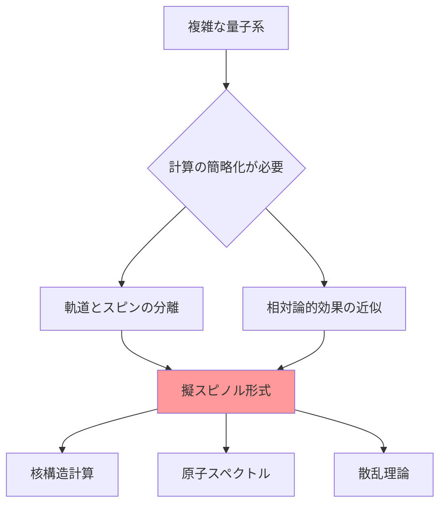

# 物理学における擬スピノル（Pseudo-spinor）

## What's this file?
> [!NOTE]
> **What**
>
> 物理学における擬スピノル（Pseudo-spinor）とは何かについて記載しています。

## Conclusion (忙しいとき向け)
> [!IMPORTANT]
> **What** : 擬スピノル（Pseudo-spinor）とは何か
>
> **Answer** : 擬スピノルは、スピノル的な変換性質を持つが、厳密なスピノルではない数学的対象。主に核物理学や原子物理学で、軌道角運動量とスピン角運動量の結合を近似的に扱う際に使用される概念。

## 目次

目次を開く

- [擬スピノルの定義](#擬スピノルの定義)
- [擬スピノルが必要な理由](#擬スピノルが必要な理由)
- [擬スピノルの数学的構造](#擬スピノルの数学的構造)
- [核物理学での応用](#核物理学での応用)
- [真のスピノルとの違い](#真のスピノルとの違い)
- [具体例](#具体例)

## 擬スピノルの定義

擬スピノル（Pseudo-spinor）は、以下の特徴を持つ数学的対象です：

1. **近似的なスピノル性質**
   - 特定の条件下でスピノルのような変換性質を示す
   - 完全なローレンツ変換に対しては真のスピノルとは異なる振る舞い

2. **軌道-スピン結合の記述**
   - 軌道角運動量 $l$ とスピン角運動量 $s$ の結合状態を表現
   - $j = l + s$ の全角運動量固有状態として振る舞う

## 擬スピノルが必要な理由

### 主な動機

1. **計算の簡略化**
   - 完全な4成分ディラックスピノルは計算が複雑
   - 2成分擬スピノルで十分な精度が得られる場合が多い

2. **物理的直観性**
   - 軌道角運動量とスピンの寄与を明確に分離
   - 非相対論的極限での理解が容易

## 擬スピノルの数学的構造

### 基本構造

擬スピノルは通常、2成分のベクトルとして表現されます：

$$\chi_{jlm} = \begin{pmatrix} \chi_{+} \\ \chi_{-} \end{pmatrix}$$

ここで：

- $j$：全角運動量
- $l$：軌道角運動量
- $m$：磁気量子数

### 構成要素

1. **上成分（$\chi_{+}$）**
   - スピンアップ状態に対応
   - $j = l + 1/2$ の場合

2. **下成分（$\chi_{-}$）**
   - スピンダウン状態に対応
   - $j = l - 1/2$ の場合

### 変換性質

擬スピノルは、以下の変換に対して特定の性質を示します：

$$\begin{aligned}
\text{回転変換：} & \quad R(\theta, \phi, \psi) \rightarrow D^{(j)}(R) \chi_{jlm} \\
\text{パリティ変換：} & \quad P \rightarrow (-1)^l \chi_{jlm} \\
\text{時間反転：} & \quad T \rightarrow (-1)^{j-m} \chi_{j,l,-m}
\end{aligned}$$

## 核物理学での応用

### 1. 核子の波動関数

原子核内の核子（陽子・中性子）の状態を記述：

$$\psi_{nljm} = R_{nl}(r) \chi_{jlm}(\theta,\phi,\sigma)$$

- $R_{nl}(r)$：動径波動関数
- $\chi_{jlm}$：角度・スピン部分（擬スピノル）

### 2. シェルモデル

核のシェルモデルでは、擬スピノル対称性が重要な役割：

- マジックナンバーの説明
- 核の励起状態の分類
- 遷移確率の計算

### 3. 散乱理論

核反応や電子散乱の記述において：

- 部分波展開での利用
- 位相シフトの計算
- 偏極観測量の予測

## 真のスピノルとの違い

| 性質 | 真のスピノル | 擬スピノル |
|------|------------|------------|
| 成分数 | 4成分（ディラック） | 2成分 |
| ローレンツ変換 | 完全に共変 | 近似的に共変 |
| 適用範囲 | 相対論的領域 | 非相対論～準相対論 |
| 計算複雑度 | 高い | 低い |
| 物理的解釈 | 粒子-反粒子を含む | 粒子のみ |

## 具体例

### 1. 重い原子の電子状態

$$\psi = \begin{pmatrix} g(r)\chi_{\kappa\mu} \\ i f(r)\chi_{-\kappa\mu} \end{pmatrix}$$

- $g(r), f(r)$：大成分と小成分の動径関数
- $\chi_{\kappa\mu}$：擬スピノル角度部分
- $\kappa$：相対論的角運動量量子数

### 2. 核子-核子散乱

散乱振幅の部分波展開：

$$f(\theta) = \sum_{j,l} (2j+1) a_{jl} P_j(\cos\theta) \chi_{jlm}$$

### 3. β崩壊の記述

原子核のβ崩壊過程での利用：

- 許容遷移と禁止遷移の分類
- 角度相関の計算
- 偏極度の予測

## 関連

- [スピノル](./2025.08.20.22.23_what_spinor_in_physics.md) - 真のスピノルについての詳細
- ディラック方程式 - 相対論的量子力学の基礎方程式
- 角運動量結合 - 擬スピノルの構成に必要な基礎理論
- 核構造理論 - 擬スピノルの主要な応用分野
