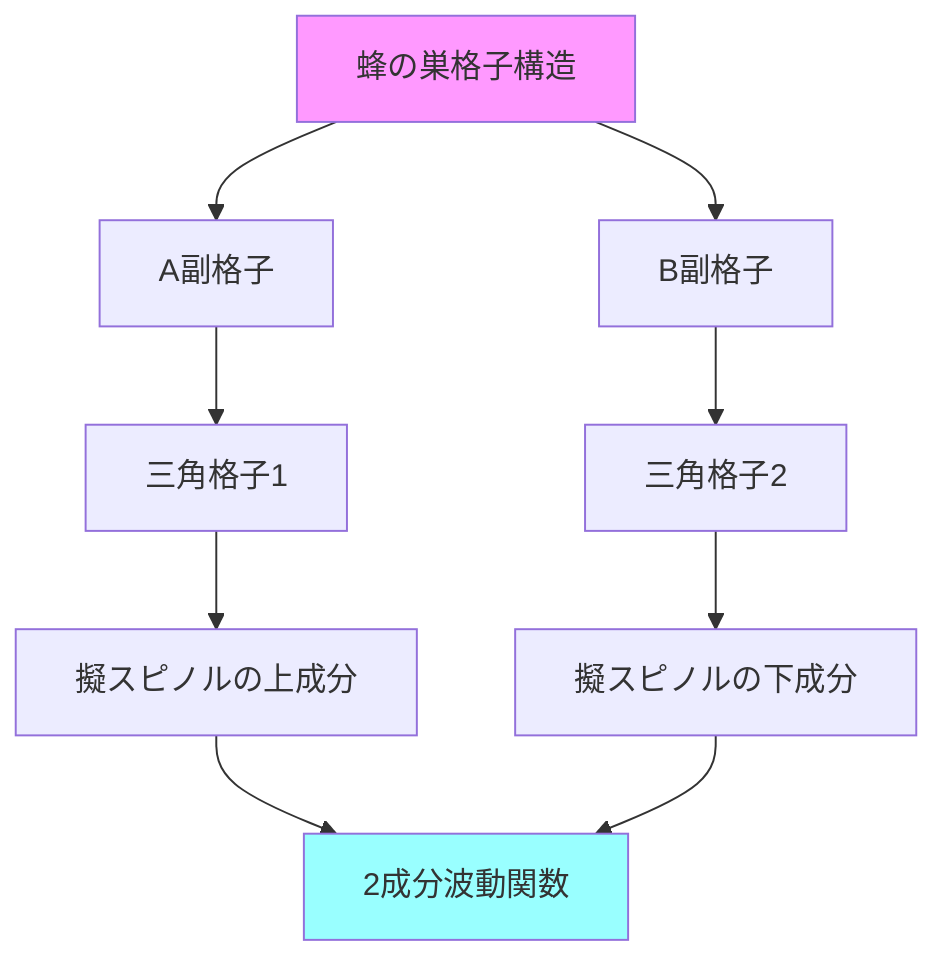
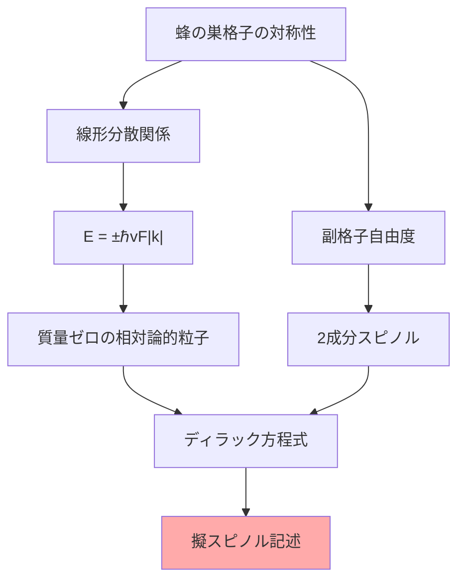
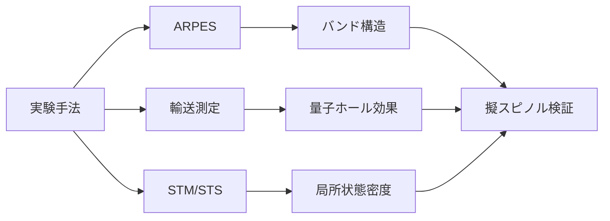

# なぜグラフェンに擬スピノルが現れるのか

## What's this file?

> [!NOTE]
> **Why**
>
> **なぜ**グラフェンの電子状態記述に擬スピノル（Pseudo-spinor）が現れるのか

## Conclusion (忙しいとき向け)

> [!IMPORTANT]
> **Why** : **なぜ**グラフェンに擬スピノルが現れるのか
>
> **Answer** : グラフェンの蜂の巣格子構造により、2つの副格子（サブラティス）間の電子の振る舞いがスピン自由度と数学的に同等な構造を持つため。この副格子自由度が擬スピノルとして振る舞い、相対論的ディラック方程式に従う質量ゼロのフェルミオンのような性質を示す。

## 目次

目次を開く

- [グラフェンの格子構造](#グラフェンの格子構造)
- [副格子の役割](#副格子の役割)
- [擬スピノルの出現メカニズム](#擬スピノルの出現メカニズム)
- [ディラック点の物理](#ディラック点の物理)
- [数学的対応関係](#数学的対応関係)
- [物理的帰結](#物理的帰結)
- [実験的検証](#実験的検証)

## グラフェンの格子構造

### 蜂の巣格子の特徴

グラフェンは炭素原子が蜂の巣状に配列した2次元材料です：

1. **基本構造**
   - 単層の炭素原子シート
   - 各炭素原子は3つの隣接原子と $sp^2$ 結合
   - 六角形の繰り返し構造

2. **副格子構造**
   - 蜂の巣格子 = 2つの三角格子（A副格子とB副格子）の組み合わせ
   - 各単位胞に2つの原子（AとB）

## 副格子の役割

### なぜ副格子が重要か

1. **電子のホッピング**
   - 最近接ホッピングはA副格子↔B副格子間のみ
   - 同じ副格子内での直接ホッピングなし

2. **対称性の破れ**
   - A副格子とB副格子は等価でない
   - この非等価性が擬スピノル自由度を生む

### 波動関数の構造

電子の波動関数は2成分で記述：

$$\Psi(\vec{r}) = \begin{pmatrix} \psi_A(\vec{r}) \\ \psi_B(\vec{r}) \end{pmatrix}$$

ここで：

- $\psi_A$：A副格子上の振幅
- $\psi_B$：B副格子上の振幅

## 擬スピノルの出現メカニズム

### タイトバインディングモデル

グラフェンのハミルトニアン（最近接ホッピングのみ）：

$$H = -t \sum_{\langle i,j \rangle} (a_i^\dagger b_j + b_j^\dagger a_i)$$

ここで：

- $t$：ホッピング積分（約2.7 eV）
- $a_i, b_j$：副格子A, Bの消滅演算子

### 運動量空間での記述

ブリルアンゾーンのK点（ディラック点）近傍で：

$$H_K = \hbar v_F \begin{pmatrix} 0 & k_x - ik_y \\ k_x + ik_y & 0 \end{pmatrix}$$

これは2次元ディラック方程式の形！

$$H_K = \hbar v_F (\sigma_x k_x + \sigma_y k_y)$$

ここで：

- $v_F$：フェルミ速度（$\approx c/300$）
- $\sigma_x, \sigma_y$：パウリ行列（擬スピン空間）

## ディラック点の物理

### なぜディラック方程式が現れるか

### 物理的意味

1. **相対論的粒子のアナロジー**
   - 電子は光速の1/300で運動
   - しかし分散関係は相対論的

2. **カイラリティ**
   - 擬スピンと運動量の結合
   - バレー依存のカイラリティ

## 数学的対応関係

### スピンと擬スピンの対比

| 性質 | 真のスピン | グラフェンの擬スピン |
|------|-----------|-------------------|
| 物理的起源 | 内在的角運動量 | 副格子自由度 |
| 自由度 | 2（↑, ↓） | 2（A, B） |
| 演算子 | パウリ行列 $\vec{\sigma}$ | 同じパウリ行列 |
| 保存則 | 角運動量保存 | 副格子対称性 |

### 有効ハミルトニアン

K点近傍での有効理論：

$$H_{eff} = v_F \vec{\sigma} \cdot \vec{p} + \Delta \sigma_z$$

ここで：

- $\vec{p} = \hbar \vec{k}$：運動量
- $\Delta$：質量ギャップ（通常はゼロ）

## 物理的帰結

### 1. クライントンネリング

擬スピノル構造により：

- 完全透過現象
- 通常の電子では起こらない

### 2. 異常量子ホール効果

$$\sigma_{xy} = \pm \frac{4e^2}{h}(n + \frac{1}{2})$$

半整数量子化の起源は擬スピノル

### 3. バレー自由度

- K点とK'点で逆のカイラリティ
- バレートロニクスへの応用

### 4. 弱局在化の抑制

擬スピノル-運動量ロッキングによる：

- 後方散乱の抑制
- 高い移動度の実現

## 実験的検証

### 観測される現象

1. **線形分散関係**
   - ARPES（角度分解光電子分光）で確認
   - ディラックコーンの観測

2. **半整数量子ホール効果**
   - 強磁場下での測定
   - 擬スピノル由来の$\pm 1/2$シフト

3. **クラインパラドックス**
   - pn接合での完全透過
   - 擬スピノル保存による

### 測定手法

## まとめ

グラフェンに擬スピノルが現れる根本的理由：

1. **構造的要因**：蜂の巣格子の2つの副格子
2. **対称性**：副格子間のホッピングのみ
3. **数学的帰結**：2成分波動関数の必然性
4. **物理的振る舞い**：相対論的ディラック粒子との類似

この擬スピノル構造が、グラフェンの特異な電子物性の源となっています。

## 関連

- [擬スピノル（Pseudo-spinor）とは](./2025.08.20.22.29_what_pseudo_spinor_in_physics.md)
- グラフェンの物性物理
- トポロジカル絶縁体
- ディラック半金属・ワイル半金属
