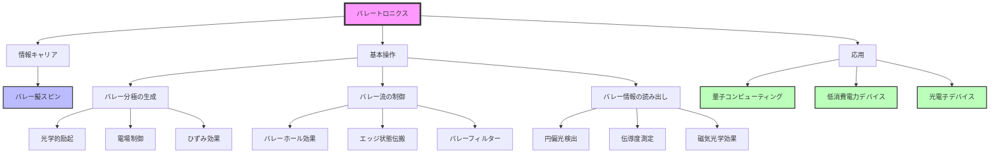

# バレートロニクスとは何か

## What's this file?
> [!NOTE]
> **What**
> 
> バレートロニクスとは何かについて記載しています。

## Conclusion (忙しいとき向け)
> [!IMPORTANT]
> **What** : バレートロニクスとは何か
> 
> **Answer** : 電子のバレー自由度を利用して情報処理を行う新しい電子工学の分野

## 目次

目次を開く

- [バレートロニクスの概要](#バレートロニクスの概要)
- [バレーとは何か](#バレーとは何か)
- [バレートロニクスの動作原理](#バレートロニクスの動作原理)
- [バレートロニクスの利点](#バレートロニクスの利点)
- [実現に向けた材料](#実現に向けた材料)
- [応用分野](#応用分野)
- [フローチャート](#フローチャート)

## バレートロニクスの概要

バレートロニクス（Valleytronics）は、固体物理学において電子のバレー自由度を利用して情報処理を行う新しい技術分野です。従来のエレクトロニクスが電荷を、スピントロニクスがスピンを情報キャリアとして使用するのに対し、バレートロニクスはバレー擬スピンを利用します。

## バレーとは何か

バレー（Valley）は、結晶の運動量空間（k空間）におけるエネルギーバンドの極小点を指します：

- **バンド構造の谷間**：エネルギーバンドが局所的に最小値を取る領域
- **擬スピン**：異なるバレーに存在する電子状態を区別する量子数
- **二値情報**：K点とK'点など、複数のバレーを0と1の情報として利用可能

## バレートロニクスの動作原理

### 1. バレー分極の生成
- 円偏光を用いた光学的励起
- 電場による選択的なバレー占有
- ひずみによるバレー分離

### 2. バレー流の制御
- バレーホール効果の利用
- トポロジカルエッジ状態による伝搬
- バレーフィルターによる選択的透過

### 3. バレー情報の読み出し
- 円偏光発光の検出
- バレー依存伝導度の測定
- 磁気光学効果の観測

## バレートロニクスの利点

1. **低消費電力**
   - 電荷の移動を伴わない情報処理が可能
   - 発熱の大幅な削減

2. **高速動作**
   - バレー緩和時間が比較的長い
   - 超高速光学制御が可能

3. **量子コンピューティングへの応用**
   - バレー量子ビットの実現
   - トポロジカルに保護された量子状態

## 実現に向けた材料

### 主要な材料系
1. **遷移金属ダイカルコゲナイド（TMD）**
   - MoS₂、WS₂、WSe₂など
   - 単層で直接バンドギャップを持つ

2. **グラフェン**
   - K点とK'点のバレー
   - ひずみによるバレー分離

3. **シリコン**
   - 従来の半導体技術との互換性
   - 6つの等価なバレー

## 応用分野

- **次世代メモリデバイス**：バレー状態を利用した不揮発性メモリ
- **量子情報処理**：バレー量子ビットによる量子コンピュータ
- **光電子デバイス**：バレー選択的な光検出器・発光素子
- **低消費電力論理回路**：バレートランジスタ

## フローチャート

## 関連
- スピントロニクス：スピン自由度を利用した電子工学
- トポロジカル絶縁体：バレー物理と密接に関連する物質相
- 2次元材料：バレートロニクスの主要な舞台
- 量子ホール効果：バレーホール効果の基礎となる現象