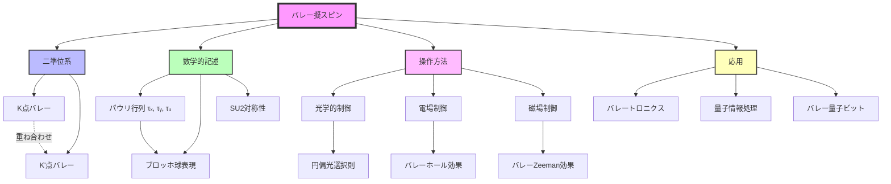

# バレー擬スピンとは何か

## What's this file?
> [!NOTE]
> **What**
> 
> バレー擬スピンとは何かについて記載しています。

## Conclusion (忙しいとき向け)
> [!IMPORTANT]
> **What** : バレー擬スピンとは何か
> 
> **Answer** : 結晶の運動量空間における異なるバレー状態を区別する擬似的なスピン量子数

## 目次

目次を開く

- [バレー擬スピンの概要](#バレー擬スピンの概要)
- [擬スピンの物理的意味](#擬スピンの物理的意味)
- [バレー擬スピンの数学的記述](#バレー擬スピンの数学的記述)
- [実スピンとの違い](#実スピンとの違い)
- [バレー擬スピンの操作](#バレー擬スピンの操作)
- [物質系での実現](#物質系での実現)
- [フローチャート](#フローチャート)

## バレー擬スピンの概要

バレー擬スピン（Valley pseudospin）は、固体物理学において結晶の運動量空間（k空間）に存在する複数のバレー状態を、スピンのような二準位系として扱うための概念です。これは実際の電子スピンとは異なる、バレー自由度に基づく擬似的な角運動量です。

## 擬スピンの物理的意味

### 基本概念
- **バレー状態の二値性**：K点とK'点など、エネルギー的に等価な2つのバレー
- **擬スピンアップ/ダウン**：異なるバレーを$|\uparrow\rangle$と$|\downarrow\rangle$状態として表現
- **量子重ね合わせ**：バレー状態の線形結合が可能

### なぜ「擬」スピンなのか
1. **実際の角運動量ではない**
   - 電子の内部自由度ではなく、結晶構造由来
   - 磁気モーメントを持たない

2. **スピンとの数学的類似性**
   - SU(2)対称性を持つ
   - パウリ行列で記述可能
   - ブロッホ球表現が可能

## バレー擬スピンの数学的記述

### パウリ行列による表現
バレー擬スピン演算子は、パウリ行列を用いて以下のように定義されます：

$$
\hat{\tau}_x = |K\rangle\langle K'| + |K'\rangle\langle K|
$$

$$
\hat{\tau}_y = -i|K\rangle\langle K'| + i|K'\rangle\langle K|
$$

$$
\hat{\tau}_z = |K\rangle\langle K| - |K'\rangle\langle K'|
$$

### バレー擬スピン状態
一般的なバレー擬スピン状態は次のように表現されます：

$$
|\psi\rangle = \alpha|K\rangle + \beta|K'\rangle
$$

ここで、$|\alpha|^2 + |\beta|^2 = 1$

### ブロッホ球表現
- **北極**：K点バレー（$|K\rangle$）
- **南極**：K'点バレー（$|K'\rangle$）
- **赤道**：バレー重ね合わせ状態
- **任意の点**：一般的なバレー擬スピン状態

## 実スピンとの違い

| 特性 | 実スピン | バレー擬スピン |
|------|----------|----------------|
| 起源 | 電子の内部角運動量 | 結晶構造の対称性 |
| 磁気モーメント | あり | なし |
| 時間反転対称性 | 反転する | 反転する |
| 空間反転対称性 | 不変 | 反転する |
| 結合定数 | 磁場と結合 | 電場・ひずみと結合 |

## バレー擬スピンの操作

### 1. バレー分極の生成
- **円偏光による選択励起**
  - 右円偏光：K点バレーを励起
  - 左円偏光：K'点バレーを励起

### 2. バレー擬スピンの回転
- **バレーZeeman効果**：磁場によるバレー分離
- **電場による操作**：バレー依存ベリー曲率の利用
- **ひずみ場**：バレーエネルギーの変調

### 3. バレー擬スピンの検出
- **円偏光発光分光**
- **バレーホール効果の測定**
- **時間分解測定**

## 物質系での実現

### 1. 遷移金属ダイカルコゲナイド（TMD）
- **MoS₂、WS₂、WSe₂**
  - 明確なK/K'バレー
  - 強いスピン軌道相互作用
  - バレー選択則が明確

### 2. グラフェン
- **バイレイヤーグラフェン**
  - 電場によるバレー分離
  - 長いバレーコヒーレンス時間

### 3. その他の2次元材料
- **シリセン、ゲルマネン**
- **ひずみシリコン**

## フローチャート

## 関連
- バレートロニクス：バレー擬スピンを利用した情報処理技術
- スピントロニクス：実スピンを利用した電子工学
- ベリー曲率：バレー物理の重要な概念
- トポロジカル物性：バレー擬スピンと密接に関連する分野
- 量子ビット：バレー擬スピンの応用先